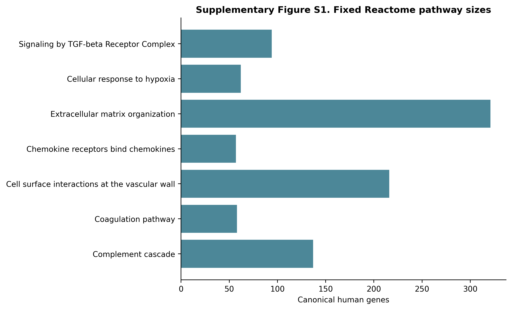
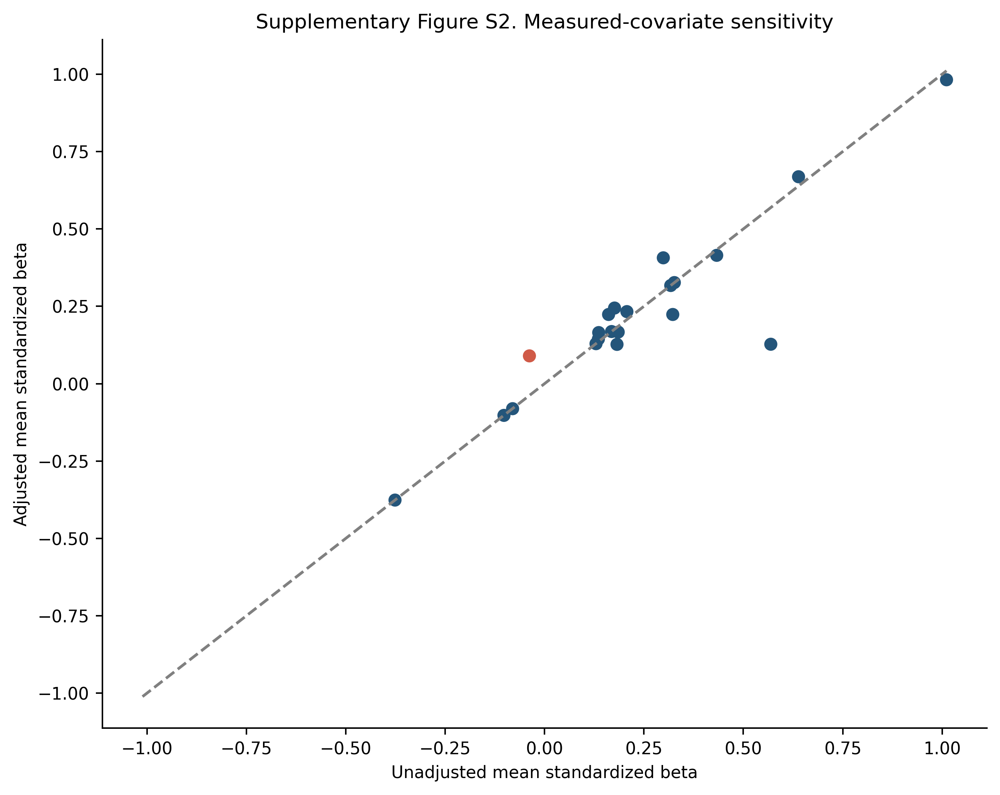

# Supplementary Information

## Study title

Compartment-Stratified Systematic Reanalysis of Complement, Coagulation, and Matrix Transcriptional Programs in Diabetic Kidney Disease

## Supplementary methods and audit boundaries

This supplement accompanies the complete machine-readable source tables. The primary evidence is restricted to three independent glomerular source studies. Contextual compartments, small cohorts, correlation flags, covariate models, and alternative probe aggregation are sensitivities. No cross-compartment pooled effect is reported. Exact search queries and translations are included in the source-data archive.

## Supplementary figures

### Supplementary Figure S1. Fixed Reactome pathway sizes

Gene counts after filtering the current Reactome GMT to current GOA human symbols.

### Supplementary Figure S2. Measured-covariate sensitivity

Unadjusted versus adjusted pathway mean standardized disease coefficients. Red denotes a direction change.

### Supplementary Figure S3. Probe-aggregation sensitivity

Pathway mean Hedges' g using the highest-all-sample-mean probe versus the median across mapped probes.

## Supplementary tables

- **Supplementary Table S1.** All 322 unique dataset records with source, screening stage, decision, and specific reason.
- **Supplementary Table S2.** Included GEO Series, source-study identity, compartment, platform, group sizes, controls, preprocessing, covariates, and analysis tier.
- **Supplementary Table S3.** Fixed Reactome pathway identifiers, memberships, source hashes, GOA filtering, and retrieval date.
- **Supplementary Table S4.** Primary three-source glomerular REML meta-analysis for the 783-gene canonical union; nonestimable members retained in multiplicity bookkeeping.
- **Supplementary Table S5.** Complete per-cohort Hedges' g, variance, Welch P value, and within-cohort canonical-family FDR.
- **Supplementary Table S6.** Two-sided joint-label permutation results and seven-pathway maxT FWER for every cohort.
- **Supplementary Table S7.** Primary glomerular pathway replication calls under the fixed two-of-three concordant maxT rule.
- **Supplementary Table S8.** All-tier compartment-specific pathway evidence summary; not used for primary replication calls.
- **Supplementary Table S9.** Leave-one-gene-out pathway mean-effect sensitivity.
- **Supplementary Table S10.** Leave-one-sample-out pathway mean-effect sensitivity; cohorts with fewer than three per group marked non-evaluable.
- **Supplementary Table S11.** Gene-level measured-covariate OLS sensitivity for datasets with usable sex and/or age metadata.
- **Supplementary Table S12.** Pathway summaries of measured-covariate sensitivity.
- **Supplementary Table S13.** Within-cohort sample-correlation screening; flags are not automatic exclusions.
- **Supplementary Table S14.** Gene-level highest-mean versus median-probe sensitivity for GSE30528/GSE30529.
- **Supplementary Table S15.** Pathway-level probe-aggregation sensitivity and canonical-union gene-effect correlations.
- **Supplementary Table S16.** Glomerular gene meta-analysis including donor-averaged GSE1009 as a small-sample sensitivity.
- **Supplementary Table S17.** Descriptive two-source tubulointerstitial gene synthesis.
- **Supplementary Table S18.** Descriptive whole/cortical-kidney gene synthesis including small studies.
- **Supplementary Table S19.** Search-evidence and canonical-reference file hashes.
