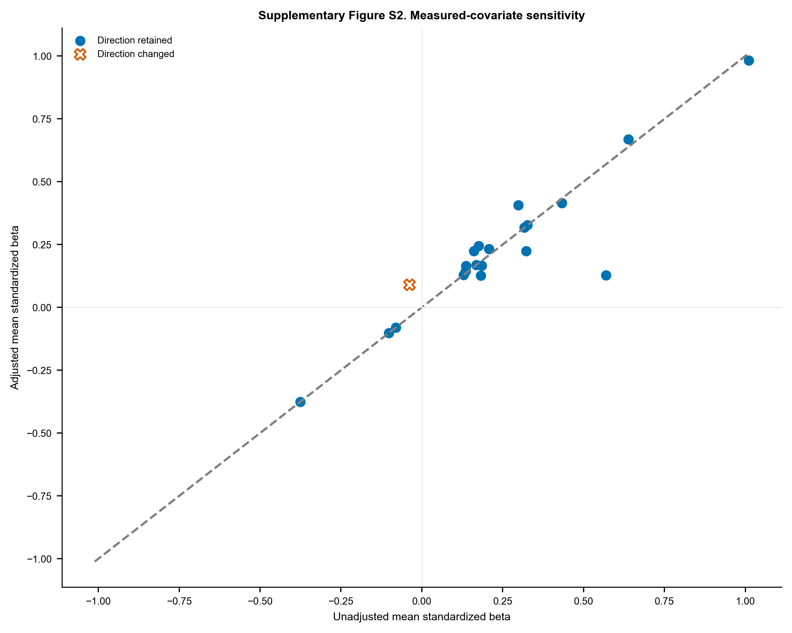
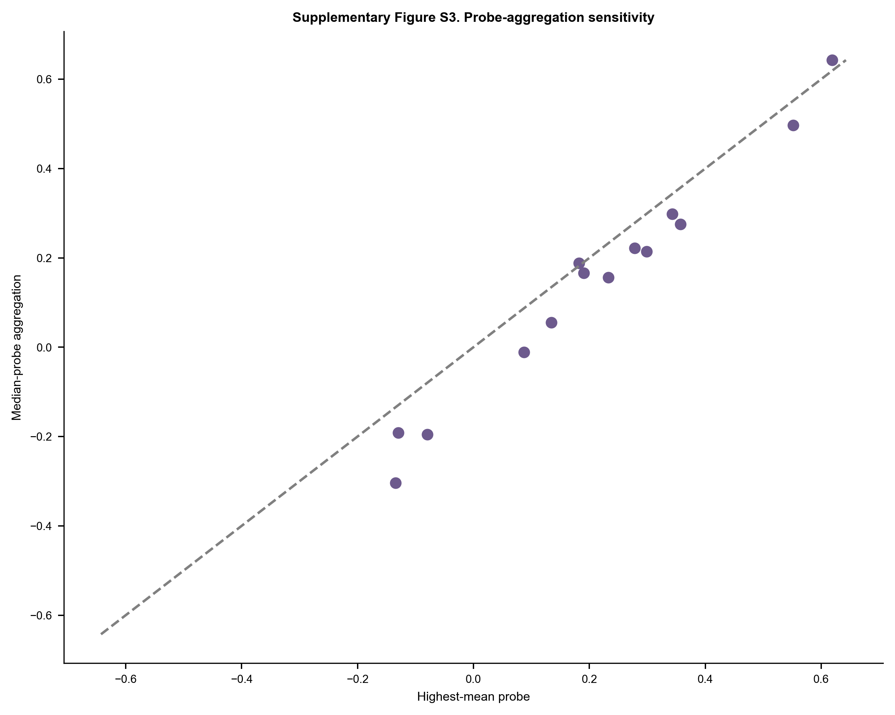

# Supplementary Information

## Study title

Compartment-Stratified Systematic Reanalysis of Complement, Coagulation, and Matrix Transcriptional Programs in Diabetic Kidney Disease

## Author

Lizhen Deng  
College of Life Science and Technology, Huazhong University of Science and Technology, Wuhan, Hubei, China  
ORCID 0009-0003-2428-8176; correspondence: 3070116993@qq.com

## Supplementary audit boundaries

The primary evidence is restricted to three independent glomerular sources. The M20 primary pathway estimand uses the fixed gene intersection measurable across all three sources. Contextual compartments, cohort-specific mapped sets, small cohorts, correlation flags, covariate models and alternative probe aggregation are sensitivities. No cross-compartment pooled effect is reported. M19 rules were not prospectively preregistered, and the common-gene/studentized M20 reanalysis was added after review; the complete history is in Supplementary Table S24.

The second-pass screening audit was performed by an AI-assisted deterministic rule check under author supervision. It covered all 53 full records, all archived source-overlap decisions and a seeded 10% sample of early exclusions. It is not described as independent human dual screening. Human confirmation remains required before submission.

## Supplementary figures

### Supplementary Figure S1. Fixed Reactome pathway sizes

Gene counts after filtering the frozen Reactome GMT to GOA human symbols.

### Supplementary Figure S2. Measured-covariate sensitivity

Unadjusted versus adjusted pathway mean standardized disease coefficients. Direction changes use both an outlined X marker and vermilion color; retained directions use filled circles and blue.

### Supplementary Figure S3. Probe-aggregation sensitivity

Pathway mean Hedges' g using the highest-all-sample-mean probe versus the median across mapped probes.

## Supplementary tables

- **Supplementary Table S1.** All 322 unique dataset records with source, screening stage, decision, and specific reason.
- **Supplementary Table S2.** Included GEO Series, source-study identity, compartment, platform, group sizes, controls, preprocessing, covariates, and analysis tier.
- **Supplementary Table S3.** Fixed Reactome pathway identifiers, memberships, source hashes, GOA filtering, and retrieval date.
- **Supplementary Table S4.** Primary three-source glomerular REML meta-analysis for the 783-gene canonical union; nonestimable members retained in multiplicity bookkeeping.
- **Supplementary Table S5.** Complete per-cohort Hedges' g, variance, Welch P value, and within-cohort canonical-family FDR.
- **Supplementary Table S6.** Primary and mapped-set sensitivity results for seven pathways in three glomerular cohorts: common-gene effects, bootstrap intervals, restricted/exact permutation P values, studentized maxT FWER and raw-mean maxT sensitivity.
- **Supplementary Table S7.** Operational two-of-three study-wise pathway criterion under the common-measurement studentized maxT analysis.
- **Supplementary Table S8.** Platform measurement coverage and fixed common-gene intersections for each pathway.
- **Supplementary Table S9.** Permutation allocation counts, Monte Carlo standard errors and binomial confidence intervals for tail probabilities.
- **Supplementary Table S10.** Gene-level random-effects synthesis with each primary source omitted in turn.
- **Supplementary Table S11.** Leave-one-gene-out pathway mean-effect sensitivity.
- **Supplementary Table S12.** Leave-one-sample-out pathway mean-effect sensitivity; cohorts with fewer than three per group marked non-evaluable.
- **Supplementary Table S13.** Gene-level measured-covariate OLS sensitivity for datasets with usable sex and/or age metadata.
- **Supplementary Table S14.** Pathway summaries of measured-covariate sensitivity.
- **Supplementary Table S15.** Within-cohort sample-correlation screening; flags are not automatic exclusions.
- **Supplementary Table S16.** Gene-level highest-mean versus median-probe sensitivity for GSE30528/GSE30529.
- **Supplementary Table S17.** Pathway-level probe-aggregation sensitivity and canonical-union gene-effect correlations.
- **Supplementary Table S18.** Glomerular gene meta-analysis including donor-averaged GSE1009 as a small-sample sensitivity.
- **Supplementary Table S19.** Descriptive two-source tubulointerstitial gene synthesis.
- **Supplementary Table S20.** Descriptive whole/cortical-kidney gene synthesis including small studies.
- **Supplementary Table S21.** Source-level risk-of-bias, confounding, control-origin, overlap and ethics/consent provenance audit; unresolved fields are explicitly marked.
- **Supplementary Table S22.** Transparent AI-assisted second-pass audit of all 53 full records, all overlap decisions and a seeded 10% sample of early exclusions; this is not represented as independent human dual screening.
- **Supplementary Table S23.** Direct comparison with closely related DKD integrative and meta-analytic studies.
- **Supplementary Table S24.** Version history for pathway, H7, probe, permutation and robustness rules, including non-preregistered/post-review status.
- **Supplementary Table S25.** Formal repository URLs and associated source-publication citations for all 11 GEO Series.
- **Supplementary Table S26.** Checksums for search evidence and the self-contained frozen M20 primary-analysis inputs.
- **Supplementary Table S27.** Search-evidence and canonical-reference file hashes.
